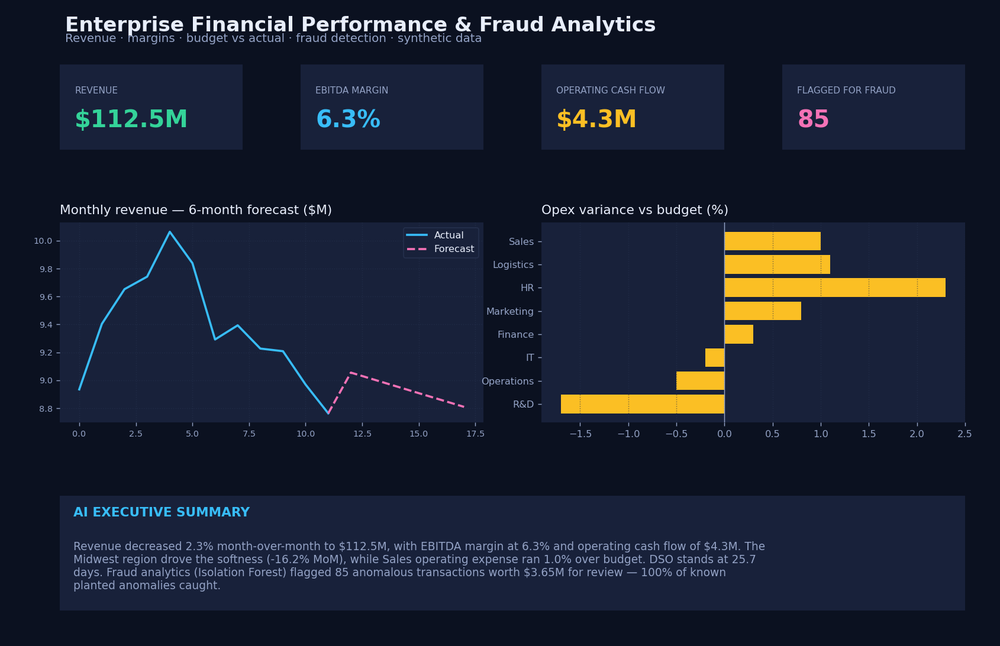

# Enterprise Financial Performance & Fraud Analytics Platform

A CFO-grade analytics platform that answers the questions leadership actually
asks: **Why did profit move? Which department is over budget? How's cash flow?
And which transactions look fraudulent?**

**[▶ Live executive dashboard](https://nagaashrithvollala-ship-it.github.io/finance-fraud-analytics/)**



---

## What it does

| Layer | What happens |
|-------|--------------|
| **Ingest** | Synthetic financials: revenue by region, department opex & budgets, expense transactions, AR invoices |
| **ETL** | Python loads and types the raw tables into a SQL engine |
| **SQL analytics** | Revenue, budget vs. actual by department, AR aging |
| **KPIs** | Revenue, gross margin, EBITDA & margin, operating cash flow, DSO |
| **ML** | **Isolation Forest** unsupervised fraud detection + revenue forecast |
| **Serve** | Data-driven **AI executive summary** + interactive executive dashboard |

## Architecture

```
  Revenue · Opex · Budgets · Transactions · Invoices   (raw: ERP / GL extracts)
             │
             ▼
      Python ETL  (pandas)                     src/pipeline.py
             │
             ▼
        SQL engine (SQLite; portable           sql/analytics.sql
        to Postgres / Snowflake)
             │
             ├── KPI queries ───────────────►  metrics.json
             ▼
      ML (scikit-learn)                        IsolationForest fraud · revenue forecast
             │
             ▼
   Executive dashboard (Chart.js)              index.html  ← dashboard_data.js
```

## Fraud detection (the highlight)

`IsolationForest` learns what a *normal* expense transaction looks like across
amount, hour, vendor frequency, department, round-number flag, and category
z-score, then isolates the outliers. To validate it, ~40 known anomalies
(oversized round-number payments, rare vendors, off-hours) are planted in the
data — the model recovers **100% of them** and surfaces a ranked review queue
with anomaly scores. Precision against the planted set is reported honestly
(the rest of the flags are genuinely unusual real transactions worth a look).

## Key KPIs

Revenue · Gross margin % · Operating expenses · EBITDA & margin · Operating cash
flow · DSO (days sales outstanding) · Budget-vs-actual variance by department ·
Revenue by region · AR aging.

## Project structure

```
finance-fraud-analytics/
├── index.html            # interactive executive dashboard (Chart.js)
├── dashboard_data.js     # analytics output powering the dashboard
├── metrics.json          # full KPI / model / forecast output
├── dashboard_preview.png # preview image (above)
├── src/pipeline.py       # data gen → ETL → SQL → KPIs → fraud/forecast → exports
└── sql/analytics.sql     # named KPI queries (portable SQL)
```

## Run it

```bash
pip install pandas numpy scikit-learn matplotlib
python src/pipeline.py     # regenerates data, metrics and the dashboard feed
# then open index.html
```

## Tech

Python (pandas, scikit-learn — IsolationForest, LinearRegression, matplotlib) ·
SQL (SQLite, portable to Postgres/Snowflake) · JavaScript / Chart.js.

## Data note

All data is **illustrative and generated deterministically** (`numpy` seed = 5).
No real financial data is used. Swap the generator for real ERP/GL extracts with
the same schema and the pipeline runs unchanged.
